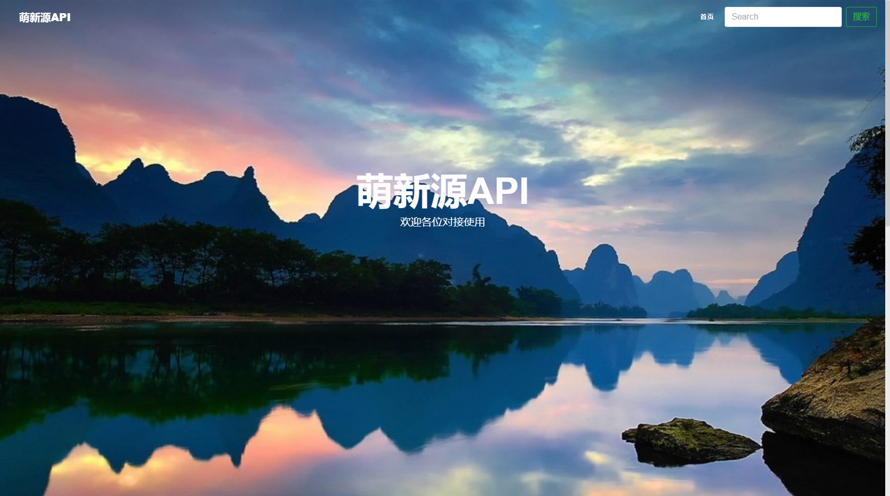
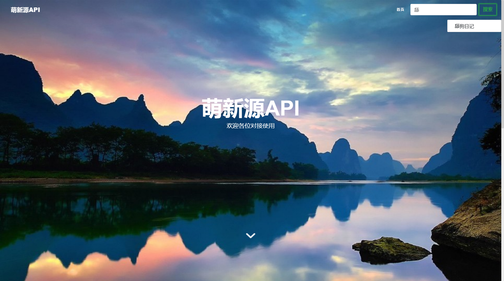
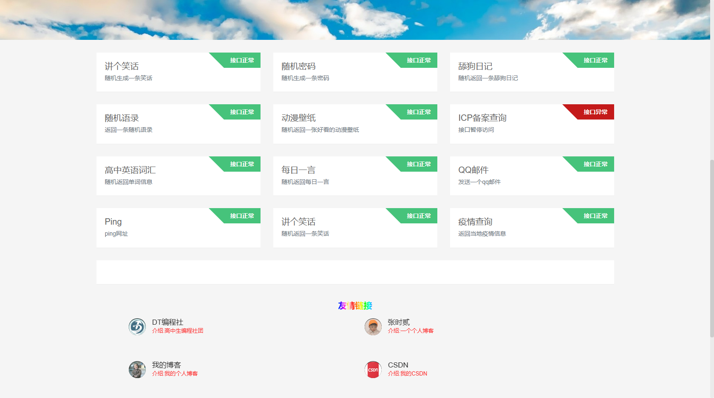
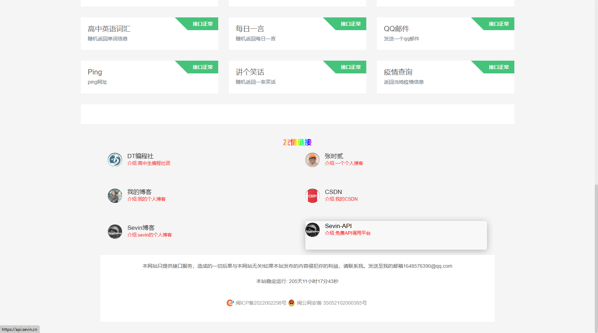
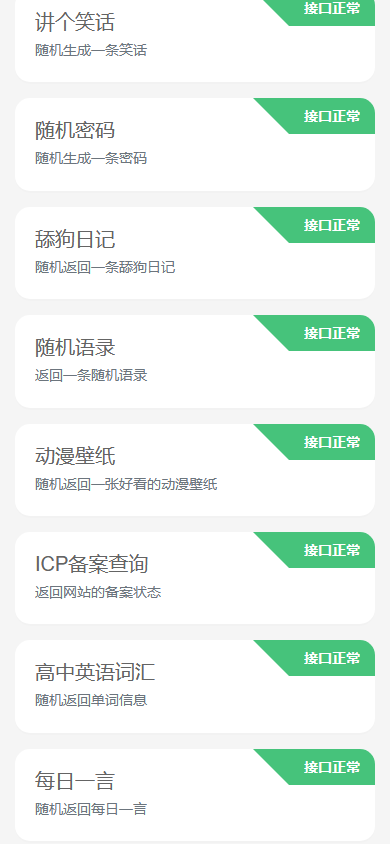
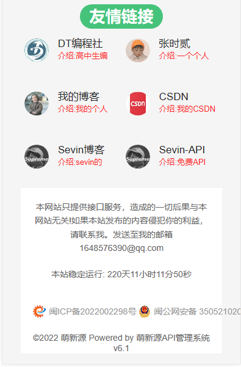

<p align="center">
  <a href="https://v2.nonebot.dev/"></a>
</p>
<div align="center">
    <h1 align="center">✨萌新源API管理系统</h1>
</div>
<p align="center">
<!-- 系统版本 -->

<!-- PHP版本 -->

<!-- Layui -->

<!-- Bootstrap -->

<!-- HTML -->

<!-- CSS -->

<!-- javascript -->

</p>


## 介绍
前端基于layui以及pear-Admin-layui,bootstrap
后端基于国产ThinkPHP框架
开发的API管理后台

## 版本要求
PHP7.3以上版本
Mysql数据库

目前仅支持mysql


## 安装教程

**安装教程看这里**[安装教程](https://blog.juncikeji.xyz/2022/08/23/mxy-api-install/)

上传源码访问站点按照安装向导提示安装系统
默认api管理后台路径网址/mxyadmin
注意要给网站配置伪静态
以我的Nginx服务器为例

```
location / {
        if (!-e $request_filename) {
   		    rewrite  ^(.*)$  /index.php?s=/$1  last;
        }
    }
```
配置伪静态的目的是为了省略入口文件，请务必配置一下。

## 使用截图

### 网站首页

电脑端手机端不同，可自定义

#### 电脑端



搜索api功能



API列表



友情链接



#### 手机端


API列表



友情链接列表



### 登录界面


### 首页


### 前台预览


### API信息管理


### 前台信息管理


### 友链管理


### 首页底部信息管理


## FAQ.常见问题解答

1.安装完成后没有背景图是空白的

​	请登录后台，找到前台管理-信息管理，接着上传背景图即可**(!!!一定要记得做)**

2.v4.42以下版本如何升级？

​	请在pubilc目录下新建user_data目录，并将public目录下jiekoushuju.json等json文件移入user_data目录，并在user目录下新建uploads目录，uploads目录内也要分别新建back,icon目录，完成上述步骤后安正常流程升级即可

3.更新完后后台信息管理一片空白怎么办？

​	请将新增功能的管理信息执行修改一次，让系统自动补全数据缺失的部分，这样应该能解决


## 更新日志
2022.8.1 v1.0Beta

2022.8.4 v2.0Beta

新增前台信息管理

2022.8.6 v2.1

新增网站维护功能

2022.8.7 v2.2

新增弹窗公告功能

2022.8.17 v3.0

新增安装向导等功能

2022.8.23 v4.0

新增首页背景，网站图标自定义

2022.8.23 v4.1

新增友链站标自定义

2022.10.22 v4.2

修复数据无法分页问题，以及数据表格缓存导致显示不正常问题

2022.11.20 v4.3

增强系统安全性

2022.11.27 v4.4

新增底部信息自定义

2022.12.3 v4.41

- 修复友情链接数据回显问题
- 修复数据表格数据条数错误问题
- 修复底部信息添加无效果问题
- 修复一些已知小bug

2022.12.11 v4.42

- 迁移数据，整合到user_data目录下
- 新增底部网站运行时间自定义

2022.12.19 v4.43

- 优化首页网站运行时间请求机制

2022.12.24 v5.0

- 大改API首页
- 新增首页标题字体颜色自定义
- 新增首页标题字体大小自定义
- 新增首页标题距离顶部距离自定义
- 优化首页动画

2022.12.24 v6.0

- 再次大改API首页
- 优化首页动画
- 新增API搜索直达
- 新增副标题自定义
- 优化api列表卡片
- 优化封面直达按钮下滑动画
- 美化友情链接

2023.1.8 v6.1

- 新增手机电脑壁纸自定义，支持不同壁纸
- 优化seo
- 做了一些细节处理


## 参与贡献
本人是web新手，所以写的系统漏洞肯定是有的，所以还要请各位大佬一起完善系统，如果您有建议可以提交lessues

